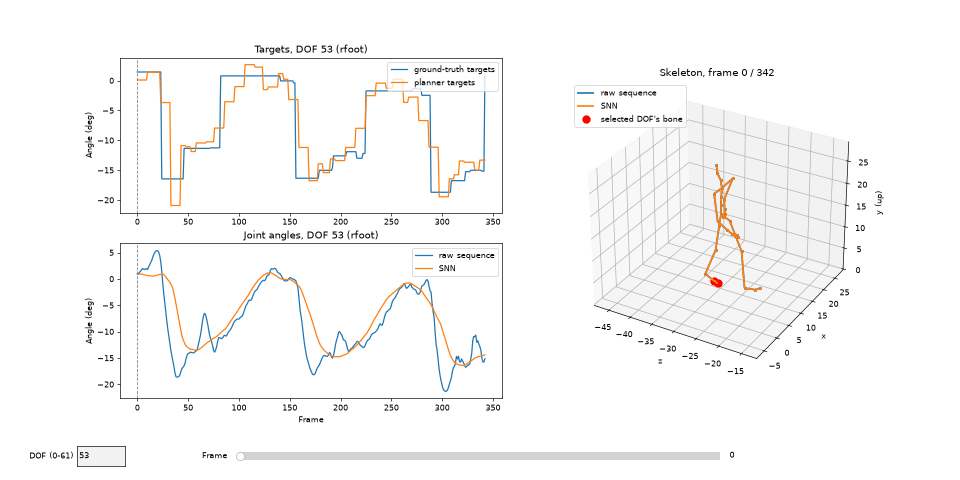

# Learnable Planner to drive SNN controllers for full-body motion reconstruction



*A spiking-neural-network controller, driven by a learned planner, reproducing a CMU walk clip in closed loop (orange) against the mocap ground truth (blue). See [Visualization](#visualization).*

## Installation

Requires Python 3.10+.

With [uv](https://docs.astral.sh/uv/):

```bash
uv venv
source .venv/bin/activate
uv pip install -r requirements.txt
```

Or with plain pip:

```bash
python -m venv .venv
source .venv/bin/activate
pip install -r requirements.txt
```

## Data
Raw data for the motion clips can be found in the CMU website of the [motion capture database](https://mocap.cs.cmu.edu/search.php?subjectnumber=%&motion=%). The skeleton file needed for motion visualization is also found in this website for each subject.

To consume them, the AMC parser and helpers are pulled from [this repo](https://github.com/CalciferZh/AMCParser.git).

## Pipeline

```
                 data/walk.amc  (CMU mocap, 120 fps, 62 DOFs)
                              |
                              v
        +-------------------------------------------------+
        | 0. IO/amc_processing.py                         |
        |    .amc -> frames x DOF matrix                  |
        |    (built inside MotionSequenceDataset)         |
        +-------------------------------------------------+
                              |  data/training_sequence.txt
                              v
        +-------------------------------------------------+
        | 1. SNN controller search                        |
        |    optimal_SNN_controller_search.py             |
        |                                                 |
        |    per joint: sample step-wise targets,         |
        |    best-first search over [speed, facil+/-,     |
        |    PSI+/-, MN pool size], scored by normalized  |
        |    RMSE. Joints are searched in parallel        |
        |    (one process per CPU core).                  |
        +-------------------------------------------------+
                              |  data/optimal_controller_specs.txt
                              v
        +-------------------------------------------------+
        | 2. Planner training                             |
        |    RegressorPlannerTrainingTesting              |
        |      .train_regressor                           |
        |                                                 |
        |    SNN rollout (simulate_SNN_states): the       |
        |    optimal controllers track the GT targets     |
        |    open loop; their angles and speeds are       |
        |    recorded per frame.                          |
        |                                                 |
        |    X = [angles, speeds] (normalized):           |
        |        GT angles + SNN speeds   -> _snnspeed    |
        |        SNN angles + SNN speeds  -> _snnstate    |
        |        GT angles + GT speeds    -> (no suffix)  |
        |    Y = GT target angle (value at next trigger)  |
        |    MLP 124 -> h -> h -> 62                      |
        +-------------------------------------------------+
                              |  models/planner/
                              |    Regressor_hid{h}_ov{k}[_snnspeed|_snnstate].pt
             +----------------+-----------------+
             |                                  |
             v                                  v
+-----------------------------+  +---------------------------------+
| 3. Offline (open loop)      |  | 4. Real time (closed loop)      |
| offline_plan_SNN_reconstr   |  | real_time_plan_SNN_recontr.py   |
|                             |  |                                 |
| planner queried on GROUND-  |  |  +-> planner(SNN angles +       |
| TRUTH states @ 7.5 Hz,      |  |  |    SNN speeds)               |
| each joint simulated        |  |  |        |  targets (per frame) |
| independently               |  |  |        v                      |
| (perform_gesture)           |  |  +-- AgentController (62 SNNs,  |
|                             |  |       dt = 0.1 ms)              |
+-----------------------------+  +---------------------------------+
             |                                  |
             | data/walk_reconstr.amc           | data/reconstructed_
             v                                  |   {targets,angles,speeds}.txt
+-----------------------------+                 v
| 5a. IO/3Dviewer.py          |  +---------------------------------+
|     skeleton playback       |  | 5b. vis_queries.py              |
+-----------------------------+  |     plots + 3D skeleton vs GT   |
                                 +---------------------------------+
```

### Run order

1. **Build the dataset once.** Step 1 reads `data/training_sequence.txt`, which is written whenever a `MotionSequenceDataset` is built. On a fresh checkout, run any script that builds it first, e.g. GT-only planner training (step 2 without `snn_specs_path`).
2. **Search the SNN controllers:** `python src/optimal_SNN_controller_search.py`. This writes `data/optimal_controller_specs.txt` and per-joint plots in `figs/SNN_joints/`.
3. **Train the planner on SNN states.** This needs the specs from step 2. Call `train_regressor` from `RegressorPlannerTrainingTesting.py`:
   ```python
   specs = "./data/optimal_controller_specs.txt"
   train_regressor("./data/walk.amc", oversampling=0, hidden_neurons=128, snn_specs_path=specs)                   # -> Regressor_hid128_ov0_snnspeed.pt
   train_regressor("./data/walk.amc", oversampling=0, hidden_neurons=128, snn_specs_path=specs, snn_angles=True)  # -> Regressor_hid128_ov0_snnstate.pt
   ```
   Re-run this step whenever the controller specs change, since the SNN speeds the planner learns from depend on them.
4. **Run the closed loop:** set `trained_planner_path` in `src/real_time_plan_SNN_recontr.py` to the model to evaluate, then `python src/real_time_plan_SNN_recontr.py`. Each frame, the planner gets the SNN's own angles and speeds. The speed is the change over the last 10 frames, computed the same way as in training.
5. **Inspect:** `python src/vis_queries.py` (set `trained_planner_path` to the same model). See [Visualization](#visualization) below.

On the walk clip, the SNN-trained planners give about half the closed-loop angle error of the GT-trained one (`_snnspeed` 7.4–8.6°, `_snnstate` 8.7–10.0°, GT 15.1–16.3° RMSE over 3 runs). The SNN's motor-neuron pool weights are random, so expect about ±1° between runs.

Run all scripts from the repository root (e.g. `python src/real_time_plan_SNN_recontr.py`), since data, model and figure paths are relative to it. The `data/`, `models/` and `figs/` directories are not tracked and must be created/populated locally.

## Visualization


`src/vis_queries.py` compares the closed-loop run (step 4) against the ground truth in one window:

- **Targets (top left):** the piecewise-constant target angles from the dataset (blue) and the ones the planner produced in the closed loop (orange).
- **Joint angles (bottom left):** the recorded mocap angle (blue) and the angle the SNN actually reached (orange). The dashed line marks the current frame.
- **Skeleton (right):** both poses at the current frame, from forward kinematics on `data/skeleton.asf` (the same code path as `IO/3Dviewer.py`). The red dots mark the bone that the selected DOF moves. The camera follows the ground-truth root.

The GIF shows DOF 53 (rfoot) over the full clip, at 4× slow motion. The SNN skeleton drifts away from the ground truth because the root translation (DOFs 0–2) is not tracked exactly in the closed loop. Press `r` to place the SNN pose on the ground-truth root and compare posture alone.

| Input | Action |
|---|---|
| ← / → or the DOF box | previous / next DOF, or jump to a typed index |
| Space | play / pause at real speed (120 fps, skipping frames if redraws are slow) |
| `,` / `.` or the frame slider | step / scrub through frames |
| `r` | toggle aligning the SNN root onto the ground-truth root |
| Drag in the 3D panel | rotate the view |

`joint` sets the DOF shown at start. To export a GIF instead of opening the window, set `gif_path` (e.g. `"./reconstruction_dof53.gif"`). It renders every frame at 30 fps, which takes about 2 minutes.
